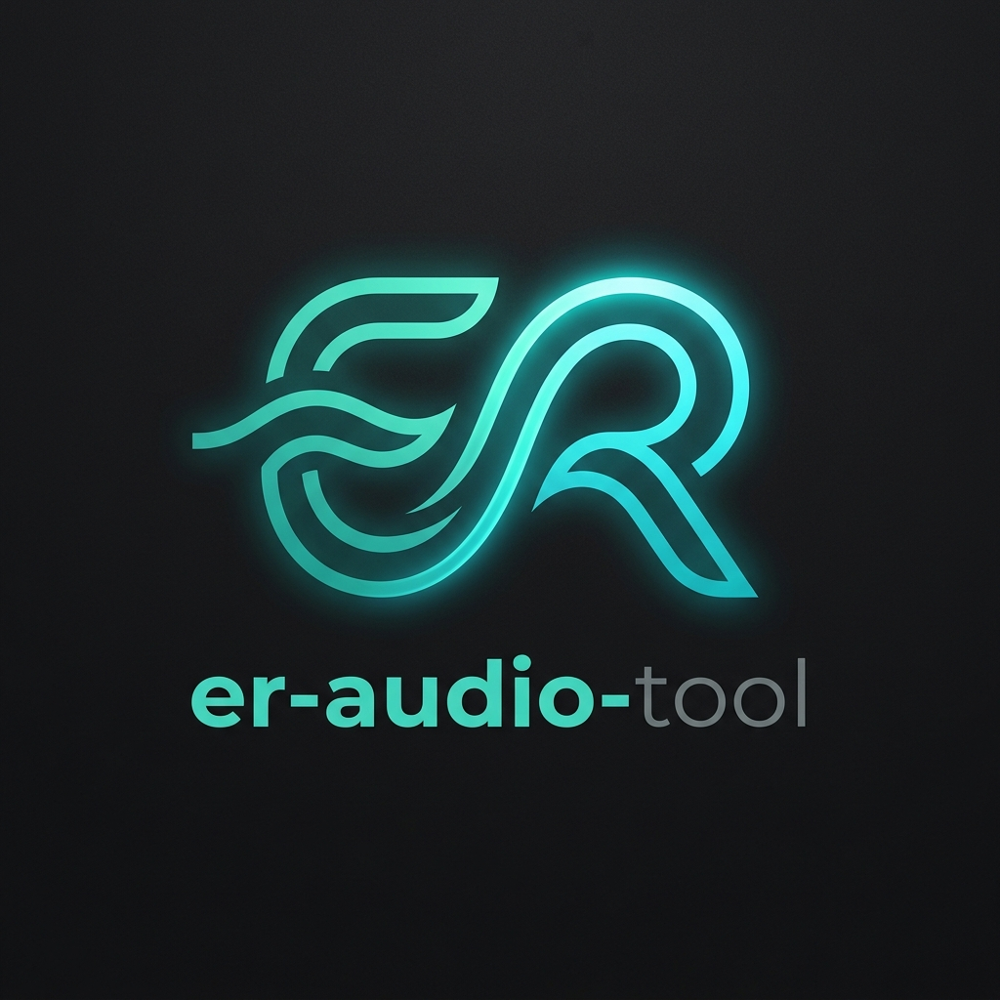

# ER-Audio-Studio

<p align="center">
  
</p>

<p align="center">
  <b>Moderne, lokale Desktop-Audio-Suite für Windows</b><br/>
  Aufnahme (Loopback & Mikrofon), Konvertierung, technische Audio-Inspektion & Kennzahlen.
</p>

---

## 🌟 Hauptfunktionen

### 1. 🎙 Professioneller Loopback & Mikrofon Recorder (WASAPI)
- **Direkte Windows CoreAudio (WASAPI) Schnittstelle**: Nimmt System-Audio, Browser, Games oder Spotify verlustfrei ohne "Stereo Mix" oder Drittanbieter-Treiber auf.
- **Mikrofon-Umschaltung**: Auf Knopfdruck zwischen System-Loopback und Mikrofon/Headset wechseln.
- **Stereo VU-Meter**: Echte Dezibel (dBFS)-Pegelanzeige in Echtzeit für L/R-Kanäle.
- **Silence-Keeper Technologie**: Verhindert Knackser oder Abreißen der Aufnahme bei leisen Passagen.
- **Integrierter Player & Historie**: Aufnahmen direkt im Fenster abspielen oder im Explorer öffnen.

### 2. 🔄 Audio-Konverter
- Schnelle Konvertierung zwischen gängigen Formaten: **MP3, WAV, FLAC, OGG, AAC/M4A**.
- Bitraten von 128 kbps bis 320 kbps (High Quality).
- Batch-fähiges Protokoll.

### 3. 📊 Technische Audio-Analyse & Inspektion
- Ermittlung von Peak-Pegeln (dBFS) pro Kanal.
- RMS-Lautheit und Berechnung des Dynamikumfangs.
- Erkennung von Clipping-Verzerrungen und Stille-Anteilen (< -60 dBFS).

### 4. ⚙️ Einstellungen & Diagnose
- Ausgabeordner frei wählbar (Standard: `Musik/ER-Audio-Studio`).
- Individuelle Dateinamen-Präfixe.
- Zweisprachige Benutzeroberfläche (Deutsch & Englisch per Umschalter).
- 100% lokal, offline und ohne Telemetrie.

---

## 🚀 Schnellstart

Einfach doppelt auf die Starter-Datei klicken:
```cmd
Start-Studio.bat
```

Oder über PowerShell kompilieren:
```powershell
.\build.ps1 -RunGui
```
